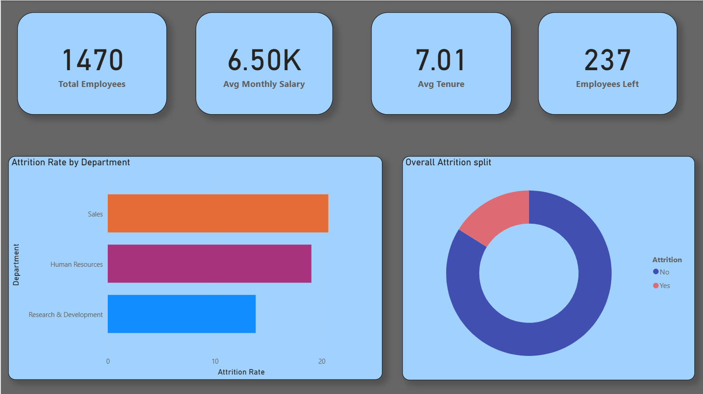
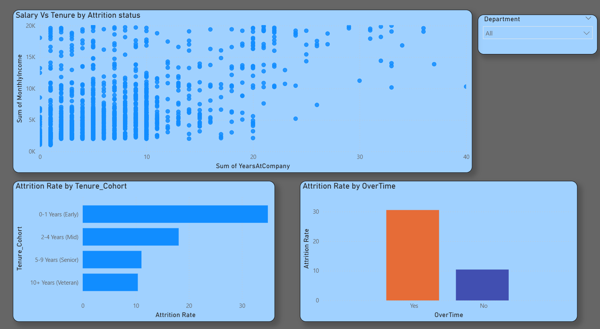
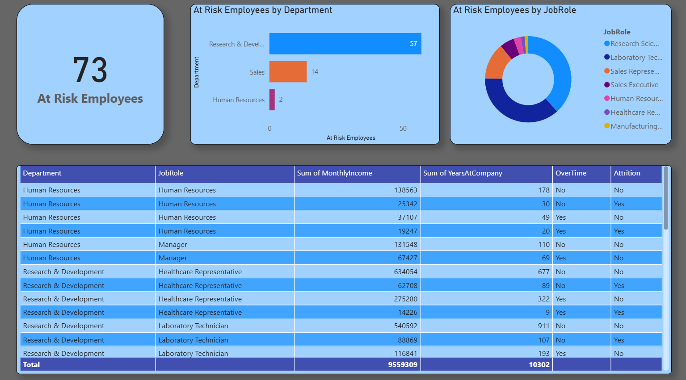

# 👥 HR Analytics Dashboard — Python | MySQL | Power BI

## 📌 Problem Statement
HR Director wants to reduce attrition from 18% to under 12% by Q4.
Analyze 1,470 employee records to identify attrition drivers,
high-risk departments, and salary compression patterns.

## 🛠️ Tools & Technologies
| Tool | Purpose |
|------|---------|
| Python (pandas, seaborn, matplotlib) | EDA & visualizations |
| MySQL | Data storage & SQL analysis |
| Power BI + DAX | Interactive 3-page dashboard |

## 📁 Project Structure
- `dataset/` — IBM HR Attrition dataset (Kaggle)
- `python_eda/` — EDA script + 6 output charts
- `sql/` — Table creation + 4 analysis queries
- `powerbi/` — .pbix dashboard file
- `screenshots/` — Dashboard preview images

## 🔍 Key Findings
- Overall attrition rate: **16.1%** (237 out of 1,470 employees)
- **Sales** has highest attrition (~20%)
- Employees with **overtime** leave 3x more (30% vs 10%)
- **Early tenure (0-1 years)** cohort has 35%+ attrition rate
- **73 employees** currently identified as at-risk
- Salary compression confirmed — leavers earned significantly less

## 📊 Dashboard Pages
### Page 1 — Overview

### Page 2 — Department Drill-down

### Page 3 — Risk Profile (with RLS)

## 🗄️ SQL Queries
| File | Analysis |
|------|---------|
| Q1 | Attrition rate per department |
| Q2 | Avg salary by dept + attrition status |
| Q3 | Tenure cohort analysis |
| Q4 | High-risk employee profiles |

## ⚙️ How to Run
1. Import `dataset/` CSV into MySQL using `sql/import_data.sql`
2. Run queries in `sql/` folder in order Q1→Q4
3. Run `python_eda/hr_eda.py` in VS Code or Jupyter
4. Open `powerbi/HR_Analytics_Dashboard.pbix` in Power BI Desktop
